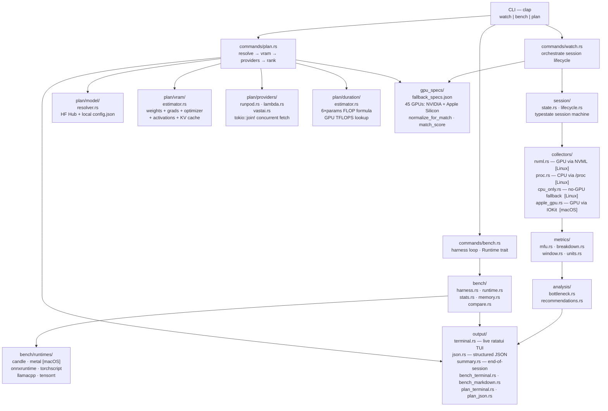

# calibrate

GPU training efficiency analyzer for NVIDIA and Apple Silicon workloads. Attach to a running training job and immediately see your Model FLOP Utilization (MFU), where compute time is being lost, and the single change that would fix it. Compare inference runtimes. Plan and cost out your next fine-tuning run against live cloud GPU pricing.

```
calibrate watch --pid 38291 --cost-per-hour 0.34
calibrate bench --model ./model.safetensors --batch-size 8
calibrate plan  --model meta-llama/Llama-3-8B --method lora --optimizer unsloth --dataset-rows 50000
```

---

## Subcommands

| Command | Description |
|---|---|
| `watch` | Attach to a training process, measure MFU and bottlenecks in real time (Linux/NVIDIA · macOS/Apple Silicon) |
| `bench` | Compare inference latency across runtime backends (Candle, Metal, ONNX, TorchScript, llama.cpp, TensorRT) |
| `plan`  | Fetch live GPU cloud prices and recommend the cheapest option for your fine-tuning workload |

---

## Architecture



---

## Install

**Pre-built binary — no Rust required**

```bash
curl --proto '=https' --tlsv1.2 -LsSf \
  https://github.com/PrajwalAmte/Calibrate/releases/latest/download/calibrate-installer.sh | sh
```

Or download a tarball directly from the [releases page](https://github.com/PrajwalAmte/Calibrate/releases) and place the binary anywhere on your `$PATH`.

**With Cargo (requires Rust 1.75+)**

```bash
cargo install calibrate
```

**Build from source**

```bash
git clone https://github.com/PrajwalAmte/Calibrate
cd calibrate/calibrate
cargo build --release
./target/release/calibrate --help
```

---

## Usage: calibrate watch

```
calibrate watch --pid <PID> [OPTIONS]

Options:
  -p, --pid <PID>               Process ID of the running training job
  -c, --cost-per-hour <USD/HR>  Hourly GPU cost (enables dollar waste display)
  -i, --interval <SECS>         Sampling interval [default: 2]
  -o, --output <FORMAT>         terminal | json  [default: terminal]
  -h, --help                    Print help
```

**Example output**

```
GPU: NVIDIA GeForce RTX 3090  •  $0.34/hr  •  Elapsed: 00:04:22

MFU ████████░░░░░░░░░░░░░░░░░░░░░░  19.3%  •  6.9 / 35.6 TFLOPS  (target >45%)

Time Breakdown
  Forward/backward  ████████████████░░░░░░░░░░░░░░   61.0%
  Data loader wait  ████████░░░░░░░░░░░░░░░░░░░░░░   28.0%  <- primary bottleneck
  CUDA sync         ██░░░░░░░░░░░░░░░░░░░░░░░░░░░░    7.0%
  Optimizer step    █░░░░░░░░░░░░░░░░░░░░░░░░░░░░░    4.0%

Hardware: Temp: 68°C  •  Power: 210W / 350W  •  VRAM: 8.0 GiB / 24.0 GiB

Recommendation: Data loader is the primary bottleneck
  [+17 ppt MFU expected]
  Add num_workers=4, pin_memory=True to your DataLoader.
```

---

## Usage: calibrate bench

```
calibrate bench --model <PATH> [OPTIONS]

Options:
  -m, --model <PATH>            Path to the model file (SafeTensors, ONNX, etc.)
  -b, --batch-size <N>          Batch size for inference [default: 1]
  -s, --seq-len <N>             Sequence length [default: 512]
  -w, --warmup <N>              Warmup iterations [default: 10]
  -r, --runs <N>                Measurement iterations [default: 100]
  -O, --optimize-for <GOAL>     latency | throughput | memory  [default: latency]
      --runtimes <LIST>         Comma-separated subset of runtimes to test
  -o, --output <FORMAT>         terminal | json | markdown  [default: terminal]
  -h, --help                    Print help
```

**Example output**

```
  Runtime       Batch    p50 (ms)    p99 (ms)   Throughput    Peak VRAM
  -----------  ------  ----------  ----------  -----------  ----------
> candle            1        8.1        12.4     123 tok/s     2.1 GiB
  onnxruntime        1        9.8        14.1     102 tok/s     2.4 GiB
  torchscript        1       11.3        17.0      88 tok/s     2.8 GiB

Recommendation: candle is fastest for latency at this batch size.
```

---

## Usage: calibrate plan

```
calibrate plan --model <ID> [OPTIONS]

Options:
  -m, --model <ID>              HuggingFace model ID or local path
      --params-b <FLOAT>        Override parameter count (billions)
      --method <METHOD>         full | lora | qlora  [default: lora]
      --optimizer <LIB>         none | unsloth | deepspeed  [default: none]
      --quantization <LEVEL>    none | 8bit | 4bit  [default: none]
      --dataset-rows <N>        Number of training rows (for duration estimate)
      --batch-size <N>          Effective batch size  [default: 4]
      --epochs <N>              Number of training epochs  [default: 1]
      --budget <USD>            Maximum total spend in dollars
      --availability <WHEN>     flexible | now  [default: flexible]
      --providers <LIST>        Comma-separated: runpod,lambda,vastai
      --mfu <FLOAT>             Observed MFU from calibrate watch (overrides 0.30 default)
  -o, --output <FORMAT>         terminal | json  [default: terminal]
  -h, --help                    Print help
```

**Example output**

```
  Model:     meta-llama/Llama-3-8B  (8.00B parameters)
  Required:  11.2 GiB VRAM
             fits 16G, 24G, 40G, 48G, 80G  tiers

  Component                    GiB
  -------------------------  -------
  Weights                       4.00
  Gradients                     0.04  (adapter only)
  Optimizer states              0.80
  Activations                   0.21  (gradient checkpointing)
  KV cache                      0.12
  Efficiency reduction         -5.17  (library savings)
  -------------------------  -------
  Total                        10.66 GiB (+ 5% margin = 11.19 GiB)

  Provider   GPU                    VRAM    $/hr    Duration     Est. Cost  Flags
  ---------  ----------------------  -----  ------  -----------  ----------  -----
> Vast.ai    RTX 3090                  24G    0.22   1.2–1.8 hr   $0.26–0.40  ~
  RunPod     RTX 4090                  24G    0.44   1.0–1.5 hr   $0.44–0.66
  Lambda     A10                       24G    0.75   1.1–1.7 hr   $0.83–1.28  !

  ~ Price volatile — Vast.ai market price; may change before launch.
  ! Unavailable    — listed but no capacity right now.

  Recommendation: Vast.ai RTX 3090 (24 GiB VRAM) offers an estimated total cost
    of $0.26–$0.40 for this workload.

  Safe alternative (stable price): RunPod RTX 4090 at $0.44/hr
    Estimated cost: $0.44–$0.66
```

---

## Integration: watch → plan

`calibrate watch` records actual MFU for your training job. Pass that figure directly to `calibrate plan` to get more accurate duration and cost estimates:

```bash
# Step 1: observe your actual MFU
calibrate watch --pid 12345
# Output shows: MFU 38.2%

# Step 2: use it to plan the full run
calibrate plan --model meta-llama/Llama-3-8B \
               --method lora --optimizer unsloth \
               --dataset-rows 50000 --epochs 3 \
               --mfu 0.38
```

---

## Requirements

| Subcommand | Platform | GPU requirement |
|---|---|---|
| `watch` | Linux or macOS | NVIDIA GPU (Linux) · Apple Silicon or AMD GPU (macOS) |
| `bench` | Linux or macOS | None (CPU-only runtimes work without a GPU) |
| `plan`  | Linux or macOS | None (fetches live cloud pricing over the internet) |

On macOS, `calibrate watch` uses IOKit to read GPU utilization and unified memory from Apple Silicon (and AMD/Intel) GPUs. GPU metrics are system-wide rather than per-process — the same data Activity Monitor shows in its GPU column.

On Linux, the NVIDIA user-space library (`libcuda.so`, `libnvidia-ml.so`) must be present at runtime — it ships with the standard NVIDIA driver package. If `nvidia-smi` works, calibrate will work.

Windows is not supported.

---

## License

MIT
